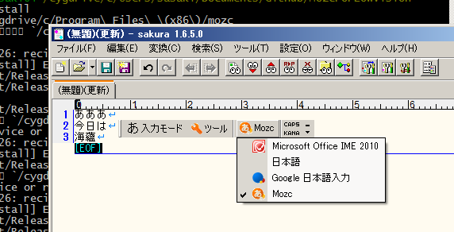
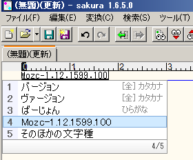
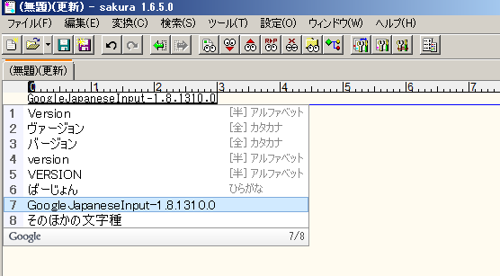

MozcForLowVision
=================
This is a project intended at developing mozc, an open source Japanese IME,
with braille typewriter mode
which helps visually impaired persons to input Kana letters with qwerty keyboard.
We just have finished preparing Makefile for non-stop building on Windows 7 and Visual Studio 2012.
No progress yet but everythig is going to be all right!

Quick Start
------------
0) Download and install Visual Studio 2012 Professional 
   and Windows 7 SDK.
   Other versions may work but I haven't confirmed it.

1) Install cygwin http://www.cygwin.com/
   Don't forget to install git, subversion (aka svn), 
   python and GNU make packages.

2) Install Python 2.7 for Windows.
   http://www.python.org/download/releases/2.7.6/ 
   Python can coexist with other versions.

3) Clone this repository to your PC.
   We'll refer to the directory as REPO.

4) Open cygwin terminal and cd to REPO.
   In my PC, I type
   cd /cygdrive/c/Users/sasaki/Documents/Github/MozcForLowVision .

5) Make it. Just type 'make'
   It syncs your source code to Google Code subversion repository,
   prepare build tools including gyp files and ninja builder,
   build mozc with Visual Studio 2012 command line tools,
   copy binary files to proper directories including system folders,
   and register IME DLL (mozc_ja.ime) to the system.

6) You may type 'make uninstall; make install' because
   IME DLL (mozc_ja.ime) is locked by IMM (input method manager).
   It depends the state of your 'Language Bar' and the mode of IME.
   You may need to run cygwin terminal as an administrator
   to touch /cygdrive/c/windows/system32 directory.

7) Feel free to contact me (<a href="http://twitter.com/TakashiSasaki">@TakashiSasaki</a> on twitter) when you need
   any assistance. Don't hesitate!
   

8) When you are unsure which kind of IME you are using, Google Japanese IME or Mozc, 
type "ba-jyonn" and try to convert it. When mozc is active and ready to convert 
phonetic input into ideographic characters, you see 'Mozc-1.12.1599.100' or something.

   
   
   If Google Japanese IME is active, you see 'GoogleJapaneseInput-1.8.1310.0' or something.

   

Details
--------
Build instruction is at https://code.google.com/p/mozc/wiki/WindowsBuildInstructions .

You don't need to download depot_tools.zip and extract depot_tools directry
because we added depot_tools directory as a git submodule.

depot_tools is a tool to sync your local mozc code to original code in Google Code.
It is a python script which invokes svn internally.
When you set PATH properly so that depot_tool finds python and svn,
it can be run both in cmd.exe and cygwin environment.
I prefer the latter, that is on cygwin. 
Install cygwin with its python and subversion package before you go on.

Open cygwin terminak, go to the top of this repository. In my case,
cd /cygdrive/c/Users/sasaki/Documents/GitHub/MozcForLowVision/ .

Initialize the repository by gclient,
python depot_tool/gclient.py config http://mozc.googlecode.com/svn/trunk/src .

Sync the repository with Google Code,
python depot_tool/gclient.py config .

